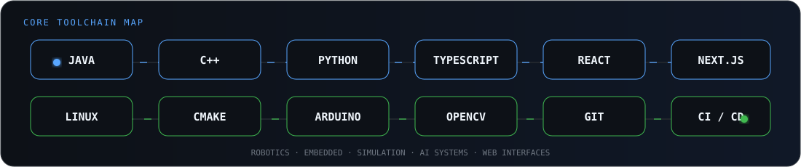
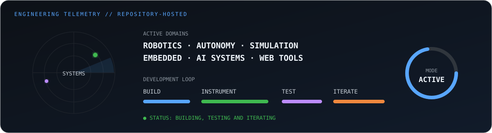
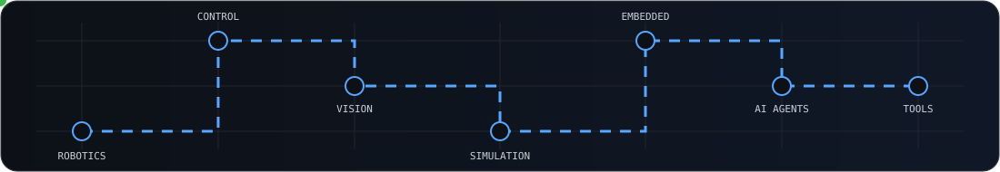

<p align="center">
  
</p>

<p align="center">
  
</p>

<p align="center">
  <strong><a href="https://github.com/JonathanStGeorges?tab=repositories">EXPLORE PROJECTS</a></strong>
  &nbsp;·&nbsp;
  <strong><a href="https://github.com/JonathanStGeorges/Portfolio">PORTFOLIO</a></strong>
  &nbsp;·&nbsp;
  <strong><a href="https://github.com/FRC1884">FRC TEAM 1884</a></strong>
</p>

## `// SYSTEM PROFILE`

```text
IDENTITY   Jonathan St-Georges / JJ / EXIBIST
ROLE       Robotics and software engineering student
MISSION    Build autonomous systems that connect software, electronics and mechanics
FOCUS      Control • Navigation • Simulation • Computer Vision • Agentic Engineering
TEAM       FRC 1884 — The Griffins
STATUS     Building, testing and iterating
```

I develop robot software, operator tooling, simulations, embedded systems and engineering infrastructure. My work generally sits at the boundary between **physical hardware and intelligent software**: sensors, motor controllers and single-board computers on one side; control algorithms, autonomous planning, web interfaces and developer tooling on the other.

## `// FEATURED BUILDS`

<p align="center">
  <a href="https://github.com/JonathanStGeorges/Season2026">
    
  </a>
  <a href="https://github.com/JonathanStGeorges/3D_DronePathPlanner">
    
  </a>
</p>

<p align="center">
  <a href="https://github.com/JonathanStGeorges/Portfolio">
    
  </a>
  <a href="https://github.com/JonathanStGeorges/PhysicsEngine">
    
  </a>
</p>

- **Competition robotics:** swerve controls, autonomous alignment, PathPlanner, PhotonVision, AdvantageKit logging, simulation and tablet operator interfaces.
- **Autonomous vehicles:** three-dimensional path design, spline visualization, flight-path tooling and hardware communication.
- **Engineering platforms:** AI-assisted development workflows, monitoring systems, reusable tooling and technical portfolio infrastructure.
- **Simulation and graphics:** experimental physics, game-engine architecture, rendering systems and deterministic simulation.

## `// ENGINEERING STACK`

<p align="center">
  
</p>

<table>
  <tr>
    <td align="center"><strong>Robotics</strong><br />WPILib · AdvantageKit · PathPlanner · PhotonVision · ROS 2</td>
    <td align="center"><strong>Embedded</strong><br />ESP32 · Teensy · Orange Pi · Sensors · Motor Control</td>
    <td align="center"><strong>Software</strong><br />Java · C++ · Python · TypeScript · React</td>
  </tr>
  <tr>
    <td align="center"><strong>Simulation</strong><br />Physics · Control Systems · 3D Visualization · Digital Twins</td>
    <td align="center"><strong>Infrastructure</strong><br />Linux · GitHub Actions · Docker · Developer Tooling</td>
    <td align="center"><strong>AI Systems</strong><br />Agents · Local Models · Memory Systems · Evaluation</td>
  </tr>
</table>

## `// CURRENT OPERATING WINDOW`

- Developing autonomous alignment, pathfinding and operator workflows for competition robotics
- Building simulation-first processes so behavior can be tested before hardware is complete
- Exploring agentic coding systems with review, monitoring and reproducible engineering guardrails
- Prototyping embedded electronics, feedback-control systems and hardware–software interfaces
- Creating interactive tools that make complex engineering systems easier to operate and understand

## `// ENGINEERING TELEMETRY`

<p align="center">
  
</p>

This dashboard describes my active engineering domains and workflow. It deliberately avoids fabricated contribution counts or unreliable third-party statistics.

## `// CONTRIBUTION CIRCUIT`

<p align="center">
  
</p>

---

<p align="center">
  <strong>Open to collaborations involving robotics, autonomous systems, simulation, developer tools and engineering education.</strong>
</p>

<p align="center">
  <sub>Build the system. Instrument it. Break assumptions. Iterate.</sub>
</p>
